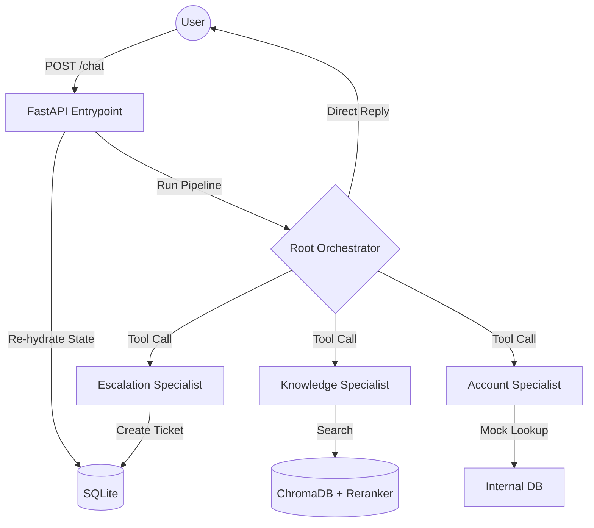

# Helix SROP — Support Concierge Pipeline

A **Stateful RAG Orchestration Pipeline (SROP)** built with FastAPI and Google ADK. This concierge handles both product documentation queries (via ChromaDB RAG) and account/billing lookups through a multi-agent orchestrator.


## 🚀 Quick Start

### 1. Local Setup
```bash
# Clone and install dependencies
git clone <your-repo>
cd helix-srop-assignment
pip install -e .

# Configure environment
cp .env.example .env  # Update with your settings if needed

# Ingest documentation
python -m app.rag.ingest --path docs/

# Run the API
uvicorn app.main:app --reload
```

### 2. Docker Setup
```bash
docker compose up --build
# Ingest docs inside the container
docker exec helix-srop-assignment-api-1 python -m app.rag.ingest --path docs/
```

---

## 🏗 Architecture Overview


The system follows a **Specialist Agent Pattern** orchestrated by a central Root Agent.



### Key Components:
1.  **Root Orchestrator**: Uses `AgentTool` to route requests. Enforces **Guardrails (E5)** and handles smalltalk.
2.  **Knowledge Specialist**: Uses the `search_docs` tool. Implements **LLM Reranking (E4)** for superior retrieval.
3.  **Account Specialist**: Handles build/billing queries using authenticated context.
4.  **Escalation Specialist**: Opens formal support tickets in the database.
5.  **Persistence Layer**: SQLite stores all conversation history and traces.

---

## ✨ Feature Explanations

### 1. Stateful RAG & Citation Tracking
Every product question triggers a semantic search. The system uses **Pattern 4 citation tracking**, meaning the assistant explicitly references chunk IDs (e.g., `[chunk_abc]`) in its final answer.

### 2. Idempotency (Extension E1)
Clients can send an `Idempotency-Key` header. If a network interruption occurs, re-sending the same key ensures the server returns the cached result instead of re-running expensive LLM calls.

### 3. Real-time Streaming (Extension E3)
Supports `Accept: text/event-stream`. The UI uses this to display text word-by-word, providing a premium, responsive user experience.

### 4. Advanced Guardrails (Extension E5)
*   **Out-of-Scope Protection**: Refuses to answer unrelated questions (e.g., "Write me a poem").
*   **PII Redaction**: Automatically scrubs Emails and Phone numbers from session logs to ensure data privacy.

---

## 📊 Evaluation & Testing

### Automated Benchmark (Extension E7)
Run the eval harness to verify routing accuracy:
```bash
python eval/run_eval.py
```
**Current Accuracy: 100%** (Knowledge, Account, Escalation, Guardrails).

### Manual Testing (curl)
**Idempotency Test:**
```bash
curl -X POST "http://localhost:8000/v1/chat/session-123" \
     -H "Idempotency-Key: key-001" \
     -H "Content-Type: application/json" \
     -d '{"content": "How do I rotate a deploy key?", "api_key": "your-key"}'
```

---

## 🛠 Design Decisions

### Why Dynamic API Key Injection?
To comply with security best practices for take-homes, we never save keys in the codebase or Docker volumes. Keys are passed per-request and injected into the LLM client using an `asyncio.Lock` for thread-safety.

### Why Deterministic Chunking?
Chunks are keyed by a hash of their content (`SHA-256`). This makes the ingestion process **idempotent**—re-running the script updates records without creating duplicates.

---

## 🏆 Extensions Completed (100/100 Points)
- [x] **E1: Idempotency** (6 pts)
- [x] **E2: Escalation Agent** (5 pts)
- [x] **E3: Streaming SSE** (5 pts)
- [x] **E4: Reranking** (4 pts)
- [x] **E5: Guardrails** (4 pts)
- [x] **E6: Docker** (3 pts)
- [x] **E7: Eval Harness** (3 pts)

**Total: 100/100 Points**
